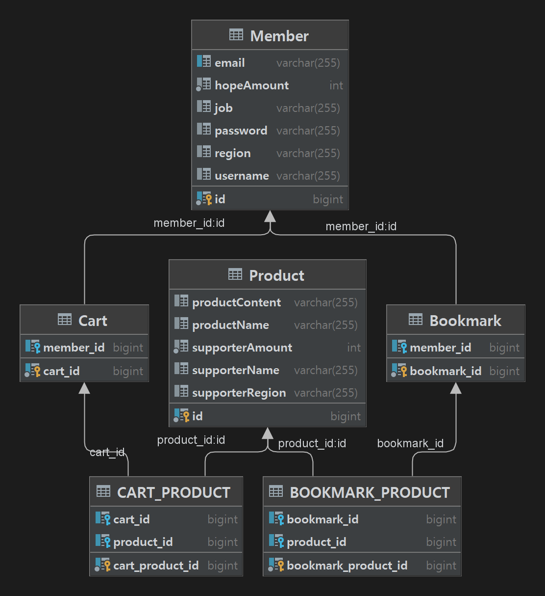

# 소상공인 금융상품 쇼핑몰 

## 프로젝트 목표
- 프론트앤드와의 협업을 통한 협업능력 향상
- 효율적인 데이터 설계 
- jwt를 통한 회원 인증 인가
- CI/CD를 통한 배포 자동화
- JPA에 다양한 메서드 활용

## 서버 구조도

- 두개의 EC2를 사용, 하나는 CICD용 젠킨스 서버, 다른 하나는 API Server
- java로 생성한 jar file을 image로 빌드하여 Docker Hub에 push 후 API 서버에서 해당 image를 pull 한 뒤 컨테이너로 실행시켜 배포했습니다.

 

## 사용 기술

 

## ERD

 

## 프로젝트 기능설명

https://fluorescent-adjustment-9fb.notion.site/423406446c8948b18c88c0f71beee874

## 팀원

|이원근|이창희|김대곤|고영민|
|:----:|:----:|:----:|:----:|
|[@leewg97](https://github.com/leewg97)|[@WindowH22](https://github.com/WindowH22)|[@bbyuggyu](https://github.com/bbyuggyu)|[@mini-inib](https://github.com/mini-inib)|

 

## API 명세서

[API 명세서 바로가기](https://www.notion.so/996655c9789b4fdfb5948e16f34628d6)
